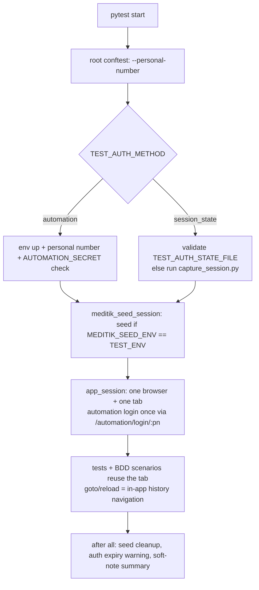

# Architecture - refuaAutomationTests

Test implementation for the Meditik application. Infrastructure (environment config, `BasePage`, browser/session plumbing, `capture_session.py`) lives in the sibling **refuaAutomationCore** repo (`../refuaAutomationCore`, installed editable).

```
refuaAutomationCore  (framework: EnvironmentManager, BasePage, capture_session.py)
        |
refuaAutomationTests (this repo: page objects, tests, BDD, workbook catalogs, DB seeding)
```

## Layers

| Layer | Location | Responsibility |
|---|---|---|
| Options / env | `conftest.py` (root) | `--personal-number` -> `TEST_PERSONAL_NUMBER`, selects automation login |
| Suite fixtures | `refua_tests/conftest.py` | Session-wide Meditik DB seed (before all / after all) |
| Auth + browser | `refua_tests/tests/conftest.py`, `refua_tests/bdd/conftest.py` | Auth check, single shared `app_session` browser/tab, artifacts, soft-note summary |
| Page objects | `refua_tests/pages/` | Screens, locators by `data-testid`, assertions helpers |
| Tests | `refua_tests/tests/` | `meditik*Sanity.py` (Ready cases), `test_*_pending.py` (Pending cases + guard) |
| BDD | `refua_tests/bdd/` | `features/*.feature`, `step_defs/*Steps.py`, `test_*_bdd.py` collectors |
| Data | `docs/setup/*_CASES.json`, `refua_tests/utils/meditik_seed.py` | Workbook catalogs; direct-DB seeding |
| Tools | `tools/` | Seed CLI, schema discovery, workbook -> JSON, pending feature generator |
| Reports | `refua_tests/reports/`, `generateReport.bat`, `viewReport.bat` | Allure generate/serve |

## Run lifecycle



- The automation session exists only inside the loaded app, so page navigation goes through app history instead of full reloads.
- Under `pytest-xdist` only worker `gw0` seeds.

## Page objects

- `meditikBasePage.py` (`MeditekBasePage`) - app shell: navbar, side menu (labels + `data-testid` map), PWA popup auto-dismiss, soft label checks.
- `automationIds.py` (`MeditikIds`) - single source of `data-testid` values and module routes.
- Shape-based bases, so new modules are mostly configuration:
  - `emptyStateModulePage.py` -> `sickDaysModulePage.py`, `vaccinationsModulePage.py`, `visitSummariesModulePage.py`
  - `*TabbedPage.py` -> My Requests, My Appointments, Referrals, Medicines
- Others: `meditikHomePage.py`, `allActionsPage.py`, `menuPages.py`, `requestForms.py`, `medicalProfilePage.py`, `speedDial.py`, `common/popUpInfo.py`.
- `softNotes.py` - non-fatal label/copy mismatches: recorded as warnings + Allure steps, summarised at teardown. Hard assertions are used only where the workbook pins exact copy.

## Workbook-driven coverage

1. Workbook (`.xlsx`) -> `tools/workbook_to_cases_json.py` -> `docs/setup/<MODULE>_CASES.json` (all columns, incl. `Clarification Status`).
2. **Ready** cases -> one test in `meditik<Module>Sanity.py` + one scenario in `features/meditik_<module>.feature` (1:1, case id in name).
3. **Pending** cases -> `test_<module>_pending.py` parametrized from the JSON, skipped at collection with the Clarification Status as reason; `tools/generate_pending_feature.py` builds `meditik_<module>_pending.feature`.
4. **Guard test** per suite fails if the JSON marks a case Ready that has no implementation.
5. `docs/setup/TEST_CASE_TRACKER.csv` maps every case to its pytest/BDD test.

Rule: never assert behaviour the workbook has not approved; missing `data-testid`s are reported, not guessed.

## Meditik DB seeding

`refua_tests/utils/meditik_seed.py` (used by the session fixture and `tools/db_seed_meditik.py`):

- Seeds 3 requests per request type for the run's personal number; dates on Israeli working days (`holidays`).
- Guards: `MEDITIK_SEED_ENV` must equal `TEST_ENV`; personal number must match `SEED_ALLOWED_PERSONAL_NUMBERS`; per-user lock until cleanup.
- Manifest per run (`MEDITIK_SEED_MANIFEST_DIR`, default `~/.refua_seeds`); cleanup mode `report` (keep) or `delete-owned`.
- Schema/FK reference: `docs/db/meditik_schema_test.json` (generated by `tools/db_discover_schema.py`, read-only).
- Seeding failures are warnings; tests that need seed data use `meditik_seeded_requests` and skip without it.

## Conventions

- File names: camelCase for pages/sanity suites/step defs (`meditikMenuSanity.py`, `menuPages.py`, `medicinesSteps.py`); `test_*.py` for pending suites and BDD collectors.
- Discovery (`pytest.ini`): files `test_*.py`, `*Sanity.py`; classes `Test*`, `Meditik*`.
- Markers are strict: add new module markers to `pytest.ini`.
- Commits: `test: ...`, `fix: ...`, `docs: ...`.
- No real personal data, phone numbers, connection strings or secrets in the repo - DigitalIDF security scans block `main`.
